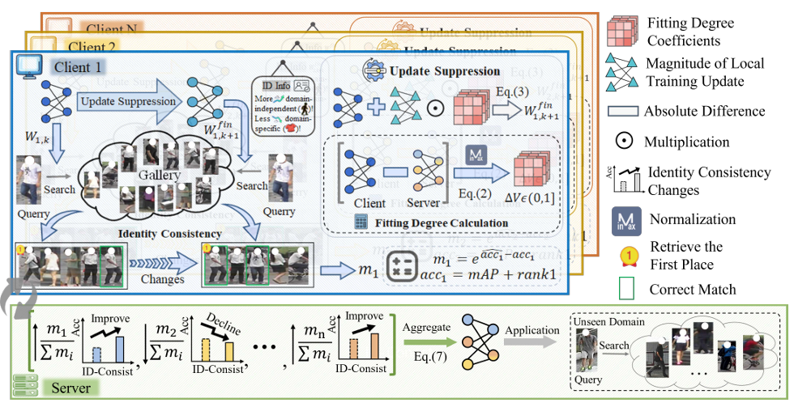
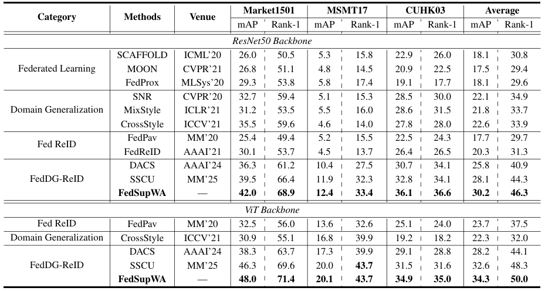

# Domain-Aware Suppression and Aggregation for Federated DG ReID (AAAI'26)

## Start Guideline

Official PyTorch implementation of the paper Domain-Aware Suppression and Aggregation for Federated DG ReID. (AAAI 2026)[Paper](https://ojs.aaai.org/index.php/AAAI/article/view/38214/42176)



## Introduction
Federated domain generalization in person re-identification (FedDG-ReID) aims to learn a privacy-preserving server model from decentralized client source domains that generalizes to unseen domains. 
Existing approaches enhance the generalizability of the server model by increasing the diversity of client person data. 
However, these methods overlook that ReID model parameters are easily biased by client-specific data distributions, leading to the capture of excessive domain-specific identity information. Such identity information (e.g., clothing style) struggles with identity information in unseen domains, thereby hindering the generalization ability of the server model.
To address this, we propose a novel FedDG-ReID framework, which mainly consists of Domain-aware Parameter Suppression (DPS) and Domain-invariant Weighted Aggregation (DWA), called FedSupWA. 
Specifically, DPS adaptively attenuates the update magnitude of the parameters based on the fit of the parameters to the client's domain, encouraging the model to focus on more generalized domain-independent identity information, such as pedestrian contours, and other consistent information across domains.
DWA enhances the server model’s generalization by evaluating the effectiveness of the client model in maintaining the consistency of pedestrian identities to measure the importance of the learned domain-independent identity information and assigning greater aggregation weights to clients that contribute more generalized information.
Extensive experiments demonstrate the effectiveness of FedSupWA, showing that it achieves state-of-the-art performance.

## News

**2026/3/11** We have released the official codes.

**2025/11/08** Accepted by AAAI-26


### Setup

- CUDA>=11.7
- At least one Nvidia GeForce RTX-3090 GPUs
- Other necessary packages listed in [requirements.txt](requirements.txt)
```bash
pip install -r requirements.txt
```
- Download [ViT pre-trained model](https://github.com/rwightman/pytorch-image-models/releases/download/v0.1-vitjx/jx_vit_base_p16_224-80ecf9dd.pth) and put it under "./checkpoints"
- Training Data
  
  Download Market1501, MSMT17 and CUHK03 datasets from http://www.liangzheng.org/Project/project_reid.html 

   Unzip all datasets and ensure the file structure is as follow:
   
   ```
   FedSupWA/data    
   │
   └───market1501 OR msmt17
        │   
        └───Market-1501-v15.09.15 OR MSMT17_V1
            │   
            └───bounding_box_train
            │   
            └───bounding_box_test
            | 
            └───query
            │   
            └───list_train.txt (only for MSMT-17)
            | 
            └───list_query.txt (only for MSMT-17)
            | 
            └───list_gallery.txt (only for MSMT-17)
            | 
            └───list_val.txt (only for MSMT-17)
   ```

### Train

- Train
```bash
CUDA_VISIBLE_DEVICES=1 python -W ignore FedSupWA.py -td market1501 --logs-dir ./logs/mar --data-dir ./data
```
### Comparison



## Contact Us

Email: yuzhixi@wust.edu.cn

## Citation
```
@inproceedings{yu2026domain,
  title={Domain-Aware Suppression and Aggregation for Federated DG ReID},
  author={Yu, Zhixi and Liu, Wei and Huang, Wenke and Yang, Bin and Bie, Qian and Wan, Guancheng and Xu, Xin},
  booktitle={Proceedings of the AAAI Conference on Artificial Intelligence},
  volume={40},
  number={14},
  pages={12231--12239},
  year={2026}
}
```


